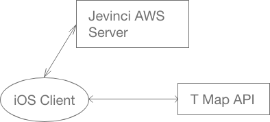

# FootPrintMap

- 소속 : Jevinci
- 개발인원 : 2명(서버개발자, 클라이언트개발자)
- 개발기간 : 1년
- 개발 플렛폼 : iOS(iPhone)
- 개발 환경 : Swift3.0, MangoDB, SpringBoot, AWS
- 앱 개발 내용 : 여유 시간과 목적지로 지역의 명소를 추천하여 도보 여행 네비게이션을 제공합니다.
- 현재상태 : 재정문제로 개발중단

## 구조


## 기능
- 경로 데이터는 T Map API를 사용하여, 지도는 GoogleMap으로 표현
- 도보여행 네비게이션
- 인상깊은 여행 경로 minimap으로 저장
- 여러 사용자가 실시간으로 위치 공유

# 기능의 코드리뷰

  <details><summary>[출발지, 목적지, 시간에 따른 경로 요청]</summary>
  <p>

  1. 메인 맵에서 출발지, 목적지, 시간 입력을 끝내면 InputViewModel에서 요청을 시작합니다.
  추천 받은 위경도 데이터로 T Map API 경로 요청을 합니다.
  ```swift
  func inputComplete(){
        guard let startpoint = sp, let endpoint = ep, let time = t else {
            return
        }
        let res = FPMResource(start: startpoint, end: endpoint, time: time)
        FPMManager.getInstance.getFPMRecommandation(resource: res){ temp in
            guard var fpmdata = temp else {return}
            guard let tempsp = self.sp else {return}
            guard let tempep = self.ep else {return}
            let newsp: FPMPlace = FPMPlace(id: nil, index: 0, place: tempsp)
            let newep: FPMPlace = FPMPlace(id: nil, index: fpmdata.waypoints.count, place: tempep)
            fpmdata.waypoints.insert(newsp, at: 0)
            fpmdata.waypoints.append(newep)
            let new = fpmdata.waypoints.enumerated().map{ index, fpmplace -> FPMPlace in
                var newfpm = fpmplace
                newfpm.index = index
                return newfpm
            }
            fpmdata.waypoints = new
            Service.instance.requestDirections(fpmdata: fpmdata){ data in
                guard let directions = data else {return}
                fpmdata.directions = directions
                FPMManager.getInstance.save(fpmdata: fpmdata)
            }
        }

    }
  ```

  2. Response 값을 FPMData로 파싱하고, FPMManager에게 전달합니다. FPMManager는 현재 지도 데이터로 업데이트되고, 모든값을 초기화합니다. GoogleMap으로 표현합니다.

  </p>
  </details>
<details><summary>[Tracker를 사용한 위치 확인과 네비게이션 안내]</summary>
<p>

1. T Map API를 통해 경로 데이터를 받은뒤 FPMManager는 Traker를 사용, 유저위치 확인과 위치에 따른 경로 정보를 표현합니다.
~~~swift
//FPMManager.swift
func start(){
      guard let T = tracker else {return}
      T.operationStart()
  }
~~~
~~~swift
//Tracker.swift
func operationStart(){
      //Async 비동기 실행,
      self.status = .initial  //시작
      CrycatLocationDefault.getInstance.startUpdateLocation()
      self.timer = Timer.scheduledTimer(timeInterval: 2.0, target: self, selector: #selector(self.operation), userInfo: nil, repeats: true)
  }
  @objc func operation(){
      if let l = CrycatLocationDefault.getInstance.devicelocation{
          print(".")
          self.delegate?.presentUserLocation(location: l.coordinate)

          //유저위치를 받은뒤에. 할일?
          switch self.status {
          case .breakaway:
              break
          case .initial:
              guard let allc = self.allCirclePoint else {return}
              self.offerActivationCircle(circles: allc)
              self.status = .waiting
          case .proceeding:
              self.removeCircleInNextCirclesByCurrentPoint()
              self.status = .waiting
          case .waiting:
              guard let fpmpoint = self.userContainInCircleChecker(location: l.coordinate) else {return}
              guard let circles = self.getNextCircleSet(fpmpoint: fpmpoint) else {return}
              self.designateCurrentDirection(fpmpoint: fpmpoint)
              self.nextCirclePoints = circles
              self.status = .proceeding
          }
      }
  }
~~~

</p>
</details>
<details><summary>[UserData저장기능, MinimapCapture]</summary>
<p>
</p>
</details>
<details><summary>[WebSocket을 통한 실시간 위치공유, Firebase를 통한 채팅, 파티 생성시 사용되는 APNS ]</summary>
<p>
</p>
</details>
<details><summary>[WebSocket 채팅 코드내용]</summary>
<p>
</p>
</details>

# NETWORK
APP에서 사용하는 모든 네트워크는 따로 분리하였습니다.

<details><summary>Task.swift</summary>
<p>

```swift
//
//  NonAuth.swift
//  fpm
//
//  Created by Je.vinci.Inc on 2017. 10. 12..
//  Copyright © 2017년 Crycat. All rights reserved.
//

import Foundation
import Alamofire
import SwiftyJSON

protocol Multipart{
}
protocol Imageable {
}
protocol Task: Multipart, Imageable{
}

extension Task{
    private func convert(request: Request) -> URLRequest{
        let urlstr = request.path
        let encoded = urlstr.addingPercentEncoding(withAllowedCharacters: .urlQueryAllowed)
        let url = URL(string: encoded!)
        let header = request.headers

        let parameter = request.parameters
        let method = request.method
        var urlrequest = URLRequest(url: url!)
        urlrequest.httpMethod = method.rawValue
        if header != nil {
            for (key, value) in header!{
                urlrequest.addValue(value as! String, forHTTPHeaderField: key)
            }
        }

        if parameter != nil{
            let data = try? JSONSerialization.data(withJSONObject: parameter!, options: [])
            urlrequest.httpBody = data
        }
        return urlrequest
    }
    func excute(request:Request,completion: @escaping (JSON?) -> ()){
        Alamofire.request(convert(request: request)).responseJSON{ response in
            switch response.result {
            case .success(let value):
                let json = JSON(value)
                NSLog("success: \(json)")
                completion(json)
            case .failure(let error):
                NSLog("fail: \(error)")
                completion(nil)
            }
        }
    }
}

extension Multipart{
    func excuteMulti(request: Request, filename: String, filedata: Data, mimetype: MimeType, completion: @escaping (JSON?) -> ()){
        guard let request = self.createMultipartURLRequest(request: request, filename: filename, filedata: filedata, mimetype: mimetype) else {return completion(nil)}
        Alamofire.request(request).responseJSON{ response in
            switch response.result {
            case .success(let value):
                let json = JSON(value)
                NSLog("success: \(json)")
                completion(json)
            case .failure(let error):
                NSLog("fail: \(error)")
                completion(nil)
            }
        }

    }
    private func createMultipartURLRequest(request: Request, filename: String, filedata: Data, mimetype: MimeType) -> URLRequest?{
        guard let url = URL(string: request.path) else {return nil}
        var result: URLRequest = URLRequest(url: url)
        let bound = self.generateBoundaryString()
        let oldheader = request.headers
        let header = ["Content-type": "multipart/form-data; boundary=\(bound)",
            "accept": "application/json"]
        let method = request.method
        guard let parameter = request.parameters else {return nil}
        let body: Data = self.createMultipartBody(parameter: parameter, filename: filename, filedata: filedata, mimetype: mimetype, boundary: bound)
        for (key, value) in header{
            result.addValue(value, forHTTPHeaderField: key)
        }
        if oldheader != nil{
            for (key, value) in oldheader!{
                let stringvalue = value as? String
                result.addValue(stringvalue ?? "", forHTTPHeaderField: key)
            }
        }
        result.httpMethod = method.rawValue
        result.httpBody = body
        return result
    }
    private func generateBoundaryString() -> String{
        return "Boundary-\(NSUUID().uuidString)"
    }
    private func createMultipartBody(parameter: Dictionary<String,Any>, filename: String, filedata: Data, mimetype: MimeType, boundary: String) -> Data{
        let body = NSMutableData()
        let name = "file"
        for (key,value) in parameter{
            body.appendString(string: "--\(boundary)\r\n")
            body.appendString(string: "Content-Disposition: form-data; name=\"\(key)\"\r\n")
            body.appendString(string: "Content-Type: application/json; charset=UTF-8\r\n\r\n")
            let stringvalue = value as? String
            body.appendString(string: "\(stringvalue ?? "")\r\n")
        }
        body.appendString(string: "--\(boundary)\r\n")
        var mime: String
        switch mimetype {
        case .png:
            mime = "image/png"
        case .jpeg:
            mime = "image/jpeg"
        }
        let defFileName = filename
        body.appendString(string: "Content-Disposition: form-data; name=\"\(name)\"; filename=\"\(defFileName)\"\r\n")
        body.appendString(string: "Content-Type: \(mime)\r\n\r\n")
        body.append(filedata)
        body.appendString(string: "\r\n")
        body.appendString(string: "--\(boundary)--")
        return body as Data
    }
}

extension Imageable{
    private func convertRequestToURLRequest(request: Request) -> URLRequest?{
        guard let url = URL(string: request.path) else {return nil}
        var urlrequest: URLRequest = URLRequest(url: url)
        if request.headers != nil {
            for (key, value) in request.headers!{
                urlrequest.addValue(value as! String, forHTTPHeaderField: key)
            }
        }
        urlrequest.httpMethod = "GET"
        return urlrequest
    }
    func excuteImage(request: Request,completion: @escaping (Data?) -> ()){
        guard let urlrequest = convertRequestToURLRequest(request: request) else {return}
        URLSession.shared.dataTask(with: urlrequest){ data, response, error in
//            guard let httpresponse = response as? HTTPURLResponse else {return}
//            guard httpresponse.statusCode == 200 else {NSLog("code : \(httpresponse.statusCode)");return completion(nil)}
            guard let imagedata = data else {return completion(nil)}
            completion(imagedata)
            }.resume()
    }
}
enum MimeType{
    case png
    case jpeg
}
extension NSMutableData {
    func appendString(string: String) {
        let data = string.data(using: String.Encoding.utf8, allowLossyConversion: true)
        append(data!)
    }
}
struct CrycatTask : Task{
}
```

</p>
</details>

<details><summary>Service.swift</summary>
<p>

```swift
//
//  Service.swift
//  fpm
//
//  Created by Je.vinci.Inc on 2017. 10. 12..
//  Copyright © 2017년 Crycat. All rights reserved.
//

import Foundation
//URL RESOURCE//URL RESOURCE//URL RESOURCE//URL RESOURCE//URL RESOURCE//URL RESOURCE//URL RESOURCE//URL RESOURCE//URL RESOURCE//URL RESOURCE//URL RESOURCE//URL RESOURCE
//let url_jevinci = "http://localhost:8080"
//let url_jevinci = "http://192.168.0.4:8080"
//let url_jevinci = "http://localhost:8080"
//let url_jevinci = "http://localhost:8080"
let url_jevinci = "http://server.jevinci.io"
//let url_jevinci = "http://172.16.3.204:8080"
//let url_jevinci = "http://192.168.0.31:8080"
//let url_jevinci = "http://192.168.0.31:8080"
let jevinci_storage = "/files/User"
let SK_base = "https://apis.skplanetx.com/tmap"
let SK_etc = "version=1&reqCoordType=WGS84GEO&resCoordType=WGS84GEO"
let SK_etc_geo = "version=1&coordType=WGS84GEO"
let SK_search = "/pois?"
let SK_detail = "/pois"
let SK_r_geocoding = "/geo/reversegeocoding?"
let SK_path = "/routes/pedestrian?"
let SK_appKey = "&appKey=dcca17d6-b5fc-32b5-991f-5240083ddf16"
//URL RESOURCE//URL RESOURCE//URL RESOURCE//URL RESOURCE//URL RESOURCE//URL RESOURCE//URL RESOURCE//URL RESOURCE//URL RESOURCE//URL RESOURCE//URL RESOURCE//URL RESOURCE

enum ServRequest: Request{
    case deletePartyUser(partyUserId: String)
    case addfriend(master: User,friend: User)
    case searchUser(nick: String)
    case searchUserWithId(id: String)
    case friendlist(jtoken: JevinciTokenModel,master: User)
    case login(apitoken: APITokenModel)
    case nickcheck(nickname: String)
    case refreshtoken(jevincitoken: JevinciTokenModel)
    case signup(signupmodel: SignUpModel)
    case profile(jevincitoken: JevinciTokenModel)
    case image(path: String)
    case searchplaces(placename: String)
    case reverseGeocodint(lat: String, lon: String)
    case direction(startplace: Place,endplace: Place)
    case recommand(jtoken: JevinciTokenModel, resource: FPMResource)
    case saveroute(token: JevinciTokenModel, fpmdata: FPMData)
    case deletefavorite(favoriteid: String)
    case savefavorite(token: JevinciTokenModel, fpmdata: FPMData)
    case loadFavorites(userid: String)
    case loadMinionWithUserId(userid: String, name: String)
    case loadThumbnail(path: String)
    case loadFPMRouteWithId(routeId: String)
    case createParty(party: FPMParty)
    case saveDevice(device: Device)
    case loadInvitationWithFPMPushId(fpmpush: FPMPush)
    case acceptparty(invitation: FPMInviation)
    case currentPartyUser(partyid: String)
    case reverseGeocording(place: Place)

    var path: String{
        switch self {
        case .reverseGeocording(let place):
            return SK_base + SK_r_geocoding + SK_etc_geo + "&lat=\(place.latitude)&lon=\(place.longitude)" + SK_appKey + "&addressType=A10"
        case .deletePartyUser(let id):
            return url_jevinci + "/party/user/\(id)"
        case .currentPartyUser(let partyid):
            return url_jevinci + "/party/user/update/\(partyid)"
        case .acceptparty:
            return url_jevinci + "/party/invite/answer"
        case .deletefavorite(let id):
            return url_jevinci + "/favorites/delete/\(id)"
        case .loadFavorites(let id):
            return url_jevinci + "/favorites/findByUserId/\(id)"
        case .login:
            return url_jevinci + "/login"
        case .refreshtoken:
            return url_jevinci + "/auth/jwt/refresh"
        case .nickcheck(let nick):
            return url_jevinci + "/common/isAvailableNickname/\(nick)"
        case .signup:
            return url_jevinci + "/common/signup"
        case .profile:
            return url_jevinci + "/user/profile"
        case .image(let path):
            return path
        case .searchplaces(let placename):
            return SK_base + SK_search + SK_etc + "&searchKeyword=\(placename)" + SK_appKey
        case .reverseGeocodint(let lat,let lon):
            return SK_base + SK_r_geocoding + SK_etc_geo + "&lat=\(lat)&lon=\(lon)" + SK_appKey + "&addressType=A10"
        case .direction(let start,let end):
            return SK_base + SK_path + SK_etc + SK_appKey + "&startX=\(start.longitude)" + "&startY=\(start.latitude)" + "&endX=\(end.longitude)" + "&endY=\(end.latitude)" + "&startName=\(start.title)" + "&endName=\(end.title)"
        case .recommand:
            return url_jevinci + "/common/footDraw"
        case .friendlist( _,let user):
            return url_jevinci + "/friend/findByUserId/\(user.id)"
        case .searchUser(let nick):
            return url_jevinci + "/user/findByKeyword/\(nick)"
        case .addfriend:
            return url_jevinci + "/friend/add"
        case .saveroute:
            return url_jevinci + "/route/save"
        case .savefavorite:
            return url_jevinci + "/favorites/add"
        case .loadMinionWithUserId(let userid,let name):
            return url_jevinci + jevinci_storage + "/\(userid)/route/\(name)"
        case .loadThumbnail(let path):
            return path
        case .loadFPMRouteWithId(let routeId):
            return url_jevinci + "/route/findOne/\(routeId)"
        case .createParty:
            return url_jevinci + "/party/create"
        case .saveDevice:
            return url_jevinci + "/common/device/save"
        case .loadInvitationWithFPMPushId(let push):
            return url_jevinci + "/party/invitation/\(push.invitation_id)"
        case .searchUserWithId(let id):
            return url_jevinci + "/user/find/\(id)"
        }
    }
    var headers: [String : Any]?{
        switch self {
        case .login,.nickcheck, .signup, .saveDevice:
            return ["Content-type":"application/json"]
        case .refreshtoken(let token):
            return ["refreshToken":"\(token.refreshToken)","Content-type":"appication/json"]
        case .profile(let jtoken), .friendlist(let jtoken, _):
            return ["Content-type":"application/json", "jwt-header":"\(jtoken.accessToken)"]
        case .recommand(let data):
            return ["Content-type":"application/json", "jwt-header":"\(data.jtoken.accessToken)"]
        case .searchUser, .addfriend, .savefavorite, .createParty, .searchUserWithId, .loadFavorites, .deletefavorite, .acceptparty, .currentPartyUser, .deletePartyUser:
            //after edit about token lazy?
            let token = JevinciTokenModel.getToken()
            let accesstoken = token?.accessToken ?? ""
            return ["Content-type":"application/json", "jwt-header":"\(accesstoken)"]
        case .loadMinionWithUserId, .loadThumbnail, .loadFPMRouteWithId, .loadInvitationWithFPMPushId:
            let token = JevinciTokenModel.getToken()
            let act = token?.accessToken ?? ""
            return ["jwt-header":"\(act)"]
        case .saveroute(let token, _):
            return ["jwt-header":"\(token.accessToken)"]
        default:
            return nil
        }
    }
    var parameters: [String : Any]?{
        switch self {
        case .login(let token):
            return token.toDic()
        case .signup(let Signup):
            return Signup.toDic()
        case .recommand(let data):
            return data.resource.toJSON()
        case .addfriend(let master,let friend):
            var dic: Dictionary<String,Any> = [:]
            dic["userId"] = master.jevinciPost()["id"]
            dic["friend"] = friend.jevinciPost()
            return dic
        case .saveroute(_,let fpmdata):
            return fpmdata.jevinciPost()
        case .savefavorite(_ ,let fpmdata):
            return fpmdata.favoritePost()
        case .createParty(let party):
            return party.toJSON()
        case .saveDevice(let device):
            return device.jevinciPost()
        case .acceptparty(let invitation):
            return invitation.jevinciPost()
        default:
            return nil
        }
    }
    var method: HTTPMethod{
        switch self {
        case .login,.signup, .recommand, .addfriend, .saveroute, .savefavorite, .createParty, .saveDevice, .acceptparty:
            return .post
        case .deletefavorite, .deletePartyUser:
            return .delete
        default:
            return .get
        }
    }
}

class Service{
    static var instance = Service()

    private init(){}
    private var task = CrycatTask()

    private func requestLogin(apitoken: APITokenModel, completion: @escaping (Int) -> ()){
        task.excute(request: ServRequest.login(apitoken: apitoken)){ tempjson in
            guard let json = tempjson else {return completion(1001)}
            if let statuscode = json["status"].int {
                switch statuscode{
                case 101:
                    //네이버토큰에러
                    completion(101)
                case 401:
                    //유저 X
                    completion(401)
                default:
                    //예외
                    completion(1002)
                }
            }else{
                //유저 O
                if let json = tempjson {
                    if let accessToken = json["accessToken"].string, let refreshToken = json["refreshToken"].string{
                        let jtoken = JevinciTokenModel(act: accessToken, rft: refreshToken, date: Date())
                        jtoken.setJevinciToken()
                        completion(501)
                    }else{
                        completion(1002)
                    }
                }else{
                    completion(1002)
                }
            }
        }
    }
    private func requestLoginDoubleForJevinciToken(apitoken: APITokenModel, completion: @escaping (JevinciTokenModel?) -> ()){
        task.excute(request: ServRequest.login(apitoken: apitoken)){ tempjson in
            guard let json = tempjson else {return completion(nil)}
            let jevincitoken = JevinciTokenModel(act: json["accessToken"].stringValue, rft: json["refreshToken"].stringValue, date: Date())
            completion(jevincitoken)
        }
    }
    private func requestAccesstokenWithRefreshtoken(token: JevinciTokenModel, completion: @escaping (JevinciTokenModel?) -> ()){
        task.excute(request: ServRequest.refreshtoken(jevincitoken: token)){ tempjson in
            guard let json = tempjson else {return completion(nil)}
            guard let act = json["accessToken"].string else {return completion(nil)}
            let new = JevinciTokenModel(act: act, rft: token.refreshToken, date: Date())
            completion(new)
        }
    }
    func searchPlacesBySKapi(placename: String, completion: @escaping (Array<Place>?) -> ()){
        task.excute(request: ServRequest.searchplaces(placename: placename)){ tempjson in
            guard let json = tempjson else {return}
            guard let searchPoiInfo = json["searchPoiInfo"].dictionary else {return}
            guard let pois = searchPoiInfo["pois"]?.dictionary else {return}
            guard let poi = pois["poi"]?.array else {return}
            let places = poi.map{ json in
                return Place(SKObject: json)
            }
            completion(places)
        }
    }
    func login(apitoken: APITokenModel, completion: @escaping (Int) -> ()){
        requestLogin(apitoken: apitoken){ code in
            completion(code)
        }
    }
    func twiceloginforJevinciToken(apitoken: APITokenModel, completion: @escaping (JevinciTokenModel?) ->()){
        requestLoginDoubleForJevinciToken(apitoken: apitoken){ temp in
            completion(temp)
        }
    }
    func refreshToken(jevinciToken: JevinciTokenModel, completion: @escaping (JevinciTokenModel?) -> ()){
        requestAccesstokenWithRefreshtoken(token: jevinciToken){ tempjevincitoken in
            guard let newtoken = tempjevincitoken else {return completion(nil)}
            newtoken.setJevinciToken()
            completion(newtoken)
        }
    }
    func checkNickname(nickname: String, completion: @escaping (String?) -> ()){
        task.excute(request: ServRequest.nickcheck(nickname: nickname)){ temp in
            guard let json = temp else {return completion(nil)}
            guard let boolean = json.bool else {return completion(nil)}
            guard boolean == true else {return completion(nil)}
            completion(nickname)
        }
    }
    func signup(signUpModel: SignUpModel, completion: @escaping(User?) -> ()){
        task.excute(request: ServRequest.signup(signupmodel: signUpModel)){ temp in
            guard let json = temp else {return completion(nil)}
            let tempuser = User(jsonObject: json)
            completion(tempuser)
        }
    }
    func profile(jtoken: JevinciTokenModel, completion: @escaping(User?) -> ()){
        task.excute(request: ServRequest.profile(jevincitoken: jtoken)){ temp in
            guard let json = temp else {return completion(nil)}
            let user = User(jsonObject: json)
            user.setUser()
            completion(user)
        }
    }
    func reversGeocodingBySKapi(lat: String, lon: String, completion: @escaping (Place?) -> ()){
        task.excute(request: ServRequest.reverseGeocodint(lat: lat, lon: lon)){ temp in
            guard let json = temp else {return}
            guard let detail = json["addressInfo"].dictionary else {return}
            guard let fullAddress = detail["fullAddress"]?.string else {return}
            guard let dlat = Double(lat) else {return}
            guard let dlon = Double(lon) else {return}
            let place = Place(lat: dlat, lon: dlon, title: fullAddress, address: fullAddress)
            completion(place)
        }
    }
    func requestRecommandation(jtoken: JevinciTokenModel, resource: FPMResource, completion: @escaping (FPMData?) -> ()){
        task.excute(request: ServRequest.recommand(jtoken: jtoken, resource: resource)){ temp in
            guard let json = temp else {return}
            let fpmdata = FPMData(jsonObject: json)
            completion(fpmdata)
        }
    }
    func requestDirection(sp: Place, ep: Place, completion: @escaping (Array<Feature>?) -> ()){
        task.excute(request: ServRequest.direction(startplace: sp, endplace: ep)){ temp in
            guard let json = temp else {return}
            guard let features = json["features"].array else {return}
            var path: Array<Feature> = []
            for feature in features{
                guard let geometry = feature["geometry"].dictionary else {return}
                guard let checktype = geometry["type"]?.string else {return}
                switch checktype {
                case "Point":
                    let point = Point(jsonObject: feature)
                    path.append(point)
                case "LineString":
                    let line = LineString(jsonObject: feature)
                    path.append(line)
                default:
                    break
                }
            }
            completion(path)
        }
    }
    func requestDirections(fpmdata: FPMData, completion: @escaping (Array<Direction>?) -> ()){
        let totalcount = fpmdata.waypoints.count - 1
        guard totalcount != -1 else {return}
        var directions: Array<Direction> = []{
            didSet{
                if directions.count == totalcount{
                    directions.sort{$0.sequence < $1.sequence}
                    completion(directions)
                }
            }
        }
        for i in 1..<fpmdata.waypoints.count{
            let sp = fpmdata.waypoints[i - 1].place
            let ep = fpmdata.waypoints[i].place
            self.requestDirection(sp: sp, ep: ep){ temp in
                guard let path = temp else {return}
                let direction = Direction(sequence: i - 1, path: path)
                directions.append(direction)
            }
        }
    }
    func requestFriendList(master: User, completion: @escaping (Array<User>?) -> ()){
        JevinciTokenModel.getToken{ temp in
            guard let token = temp else {return}
            self.task.excute(request: ServRequest.friendlist(jtoken: token, master: master)){ temp in
                guard let json = temp else {return}
                guard let list = json.array else {return}
                let friends = list.map{ (json) -> User in
                    let user = json["friend"]
                    return User(jsonObject: user)
                }
                completion(friends)
            }
        }
    }
    func searchUserWithNick(nick: String, completion: @escaping (Array<User>?) -> ()){
        task.excute(request: ServRequest.searchUser(nick: nick)){ temp in
            guard let json = temp else {return}
            guard let jsonusers = json.array else {return}
            let users = jsonusers.map{ (json) -> User in
                return User(jsonObject: json)
            }
            completion(users)
        }
    }
    func addFriend(friend: User, completion: @escaping (Bool) -> ()){
        User.getUser{ temp in
            guard let user = temp else {return completion(false)}
            self.task.excute(request: ServRequest.addfriend(master: user, friend: friend)){ temp in
                guard temp != nil else {return completion(false)}
                completion(true)
            }
        }
    }
    //Multipart
    func saveRoute(miniondata: Data, minionname: String, completion: @escaping (FPMData?) -> ()){
        JevinciTokenModel.getToken{ temp in
            guard let token = temp else {return completion(nil)}
            guard let fpmdata = FPMManager.getInstance.fpmdata else {return completion(nil)}
            self.task.excuteMulti(request: ServRequest.saveroute(token: token, fpmdata: fpmdata), filename: minionname, filedata: miniondata, mimetype: MimeType.png){ temp in
                guard let json = temp else {return}
                let fpmdata = FPMData(jsonObject: json)
                completion(fpmdata)
            }
        }

    }
    func saveFavorite(fpmdata: FPMData, completion: @escaping (Int?) -> ()){
        JevinciTokenModel.getToken{ temp in
            guard let token = temp else {return completion(nil)}
            self.task.excute(request: ServRequest.savefavorite(token: token, fpmdata: fpmdata)){ tempjson in
                guard let json = tempjson else {return completion(nil)}
                let id = json["id"].intValue
                completion(id)
            }
        }

    }
    func loadMinion(imagename: String, completion: @escaping (Data?) -> ()){
        User.getUser{ tempuser in
            guard let user = tempuser else {return}
            self.task.excuteImage(request: ServRequest.loadMinionWithUserId(userid: String(user.id), name: imagename)){ tempdata in
                guard let data = tempdata else {return completion(nil)}
                completion(data)
            }
        }
    }
    func loadThumbnail(path: String, completion: @escaping (Data?) ->()){
        task.excuteImage(request: ServRequest.loadThumbnail(path: path)){ tempdata in
            guard let data = tempdata else {return completion(nil)}
            completion(data)
        }
    }
    func loadRoute(routeId: String, completion: @escaping (FPMData?) -> ()){
        task.excute(request: ServRequest.loadFPMRouteWithId(routeId: routeId)){ tempjson in
            guard let json = tempjson else {return completion(nil)}
            let route = FPMData(jsonObject: json)
            completion(route)
        }
    }
    func createParty(party: FPMParty, completion: @escaping (FPMParty?) -> ()){
        task.excute(request: ServRequest.createParty(party: party)){ temp in
            guard let json = temp else {return completion(nil)}
            let party = FPMParty(json: json)
            completion(party)
        }
    }
    func saveDevice(device: Device, completion: @escaping (Device?) -> ()){
        task.excute(request: ServRequest.saveDevice(device: device)){ temp in
            guard let json = temp else {return completion(nil)}
            let device = Device(jsonObject: json)
            completion(device)
        }
    }
    func loadInvitation(push: FPMPush, completion: @escaping (FPMInviation?) -> ()){
        task.excute(request: ServRequest.loadInvitationWithFPMPushId(fpmpush: push)){ temp in
            guard let json = temp else {return completion(nil)}
            let invitation = FPMInviation(json: json)
            completion(invitation)
        }
    }
    func loadUser(id: String, completion: @escaping (User?) -> ()){
        task.excute(request: ServRequest.searchUserWithId(id: id)){ temp in
            guard let userjson = temp else {return completion(nil)}
            let user = User(jsonObject: userjson)
            completion(user)
        }
    }
    func loadFavorites(userid: Int, completion: @escaping (Array<FPMData>?,Array<Int>?) -> ()){
        task.excute(request: ServRequest.loadFavorites(userid: String(userid))){ temp in
            guard let json = temp else {return completion(nil,nil)}
            guard let datas = json.array else {return completion(nil,nil)}
            var favoritesId: Array<Int> = []
            let fpmdatas = datas.map{ json -> FPMData in
                let route = json["route"]
                let id = json["id"].intValue
                favoritesId.append(id)
                return FPMData(jsonObject: route)
            }
            completion(fpmdatas,favoritesId)
        }
    }
    func deleteFavorite(favoriteid: String, completion: @escaping (Bool) -> ()){
        task.excute(request: ServRequest.deletefavorite(favoriteid: favoriteid)){ temp in
            guard let json = temp else {return completion(false)}
            completion(true)
        }
    }
    func acceptFPMParty(invitation: FPMInviation, completion: @escaping (User?) -> ()){
        task.excute(request: ServRequest.acceptparty(invitation: invitation)){ tempuser in
            guard let json = tempuser else {return completion(nil)}
            let jsonuser = json["user"]
            let user = User(jsonObject: jsonuser)
            guard user.nickname.count > 0 else {return completion(nil)}
            completion(user)
        }
    }
    func updatePartyUser(partyid: String, completion: @escaping ([User]?) -> ()){
        task.excute(request: ServRequest.currentPartyUser(partyid: partyid)){ tempusers in
            guard let json = tempusers else {return completion(nil)}
            print(json)
            guard let array = json.array else {return completion(nil)}
            let users = array.map{ j -> User in
                return User(jsonObject: j["user"])
            }
            completion(users)
        }
    }
    func deletePartyUser(partyid: String,userid: String, completion: @escaping (Bool) -> ()){
        task.excute(request: ServRequest.currentPartyUser(partyid: partyid)){ tempusers in
            guard let json = tempusers else {return completion(false)}
            guard let array = json.array else {return completion(false)}
            let deleteuser = array.filter{ j -> Bool in
                let user = User(jsonObject: j["user"])
                let strid = String(user.id)
                if strid == userid {
                    return true
                }else{
                    return false
                }
            }
            guard deleteuser.count == 1 else {return completion (false)}
            guard let one = deleteuser.first else {return completion(false)}
            guard let seq = one["seq"].int else {return completion (false)}
            let pid = String(seq)
            self.task.excute(request: ServRequest.deletePartyUser(partyUserId: pid)){ temp in
                guard let json = temp else {return completion(false)}
                print(json)
                completion(true)
            }
        }
    }
    func getAddressMylocationSKReverseGeocoding(place: Place,completion: @escaping (Place?) -> ()){
        task.excute(request: ServRequest.reverseGeocording(place: place)){ json in
            guard let detail = json?["addressInfo"] else{
                return completion(nil)
            }
            var place = Place(SKObject: detail)
            place.title = "내 위치"
            completion(place)
        }
    }
}

```

</p>
</details>

<details><summary>HTTPProtocol.swift</summary>
<p>

```swift
//
//  HTTPProtocol.swift
//  fpm
//
//  Created by Je.vinci.Inc on 2017. 10. 12..
//  Copyright © 2017년 Crycat. All rights reserved.
//

import Foundation

public enum HTTPMethod: String {
    case post			= "POST"
    case put				= "PUT"
    case get				= "GET"
    case delete			= "DELETE"
    case patch			= "PATCH"
}

public protocol Request {
    var path			: String				{ get }

    var method		: HTTPMethod			{ get }

    var parameters	: [String: Any]?		{ get }

    var headers		: [String: Any]?		{ get }
}

```

</p>
</details>

# MODEL

<details><summary>Place.swift</summary>
<p>

```swift
//
//  Place.swift
//  fpm
//
//  Created by Je.vinci.Inc on 2017. 10. 20..
//  Copyright © 2017년 Crycat. All rights reserved.
//

import Foundation
import SwiftyJSON
import CoreLocation

struct Place: JSONAble {
    var id: String

    var longitude: Double
    var latitude: Double
    var title: String
    var address: String
    var imageUrl: String?
    var placeUrl: String?
    var addressBCode: String?
    var distance: String?
    var category: String?
    var phone: String?
    var newAddress: String?

    init(lat: Double, lon: Double, title: String, address: String){
        self.id = "-1"
        self.longitude = lon
        self.latitude = lat
        self.title = title
        self.address = address
    }
    init(jsonObject: JSON) {
        self.id = jsonObject["id"].stringValue
        self.category = jsonObject["category"].string
        self.phone = jsonObject["phone"].string
        self.newAddress = jsonObject["newAddress"].string
        self.longitude = jsonObject["longitude"].doubleValue
        self.latitude = jsonObject["latitude"].doubleValue
        self.imageUrl = jsonObject["imageUrl"].string
        self.title = jsonObject["title"].stringValue
        self.placeUrl = jsonObject["placeUrl"].string
        self.address = jsonObject["address"].stringValue
        self.addressBCode = jsonObject["addressBCode"].string
        self.distance = jsonObject["distance"].string
    }
    init(SKObject: JSON){
        self.id = SKObject["id"].stringValue
        self.title = SKObject["name"].stringValue
        self.latitude = SKObject["noorLat"].doubleValue
        self.longitude = SKObject["noorLon"].doubleValue
        let uperaddr = SKObject["upperAddrName"].stringValue
        let middleaddr = SKObject["middleAddrName"].stringValue
        let loweraddr = SKObject["lowerAddrName"].stringValue
        let detailaddr = SKObject["detailAddrName"].stringValue
        let firstbuildno = SKObject["firstBuildNo"].stringValue
        self.address = uperaddr + " " + middleaddr + " " + loweraddr + " " + detailaddr + " " + firstbuildno
        self.phone = SKObject["telNo"].stringValue
    }
    init(POI: JSON){
        self.id = POI["id"].stringValue
        self.title = POI["name"].stringValue
        self.latitude = POI["lat"].doubleValue
        self.longitude = POI["lon"].doubleValue
        self.address = POI["address"].stringValue
        self.phone = POI["tel"].string
    }
    func getDistance(place: Place) -> Double{
        let start = CLLocation(latitude: self.latitude, longitude: self.longitude)
        let end = CLLocation(latitude: place.latitude, longitude: place.longitude)
        return end.distance(from: start)
    }
}

```

</p>
</details>

<details><summary>FPMRoute.swift</summary>
<p>

[장소 - 장소의 하나의 모델 입니다.]
```swift
//  FPMRoute.swift
//  fpm
//
//  Created by Je.vinci.Inc on 2017. 10. 23..
//  Copyright © 2017년 Crycat. All rights reserved.
//

import Foundation
import GoogleMaps
import SwiftyJSON
import Darwin

enum FEATURETYPE :String{
    case POINT = "Point"
    case LINESTRING = "LineString"
}

enum POINTTYPE: String{
    case STARTPOINT = "SP"
    case ENDPOINT = "EP"
    case GP = "GP"
}

enum TURNTYPE: Int{
    case straight = 11
    case leftturn = 12
    case rightturn = 13
    case uturn = 14
    case eightturn = 16
    case tenturn = 17
    case twoturn = 18
    case fourturn = 19
    case wp = 184
    case wp1 = 185
    case wp2 = 186
    case wp3 = 187
    case wp4 = 188
    case wp5 = 189
    case overpass = 125
    case wtf = 126
    case enterstairs = 127
    case enterrunway = 128
    case enterstairsrunway = 129
    case start = 200
    case end = 201
    case crosswalk = 211
    case leftcrosswalk = 212
    case rightcrosswalk = 213
    case eightcrosswalk = 214
    case tencrosswalk = 215
    case twocrosswalk = 216
    case fourcrosswalk = 217
    case elevator = 218
    case tempstraight = 233
}

class Feature{
    var type: FEATURETYPE
    var index: Int
    var name: String?
    var description: String?
    init(featureType: FEATURETYPE, index: Int, description: String, name: String) {
        self.type = featureType
        self.index = index
        self.description = description
        self.name = name
    }
    func returnType() -> FEATURETYPE{
        return self.type
    }
}

class Point: Feature{
    var pointtype: POINTTYPE
    var pointindex: Int
    var turntype: TURNTYPE
    var coordinate: CLLocationCoordinate2D
    var nearpoiname: String?
    var nearpoix: String?
    var nearpoiy: String?
    var intersectionname: String?
    var facilitytype: String?
    var facilityname: String?
    var direction : String?
    var Ntotaldistance: Int?
    var totaltime: Int?
    init(featureType: FEATURETYPE, index: Int, pointType: POINTTYPE, pointindex: Int, turnType: TURNTYPE,coordinate: CLLocationCoordinate2D, description: String, name: String) {
        self.pointtype = pointType
        self.pointindex = pointindex
        self.turntype = turnType
        self.coordinate = coordinate
        super.init(featureType: featureType, index: index, description: description,name: name)
    }
    init(jsonObject: JSON){
        let property = jsonObject["properties"]
        let index = property["index"].intValue
        self.pointindex = property["pointIndex"].intValue
        self.pointtype = POINTTYPE(rawValue: property["pointType"].stringValue)!
        self.turntype = TURNTYPE(rawValue: property["turnType"].intValue)!
        let geometry = jsonObject["geometry"]
        let coordinate = geometry["coordinates"].arrayValue.map({$0.doubleValue})
        self.coordinate = CLLocationCoordinate2D(latitude: coordinate[1], longitude: coordinate[0])
        let description = property["description"].stringValue
        let name = property["name"].stringValue
        super.init(featureType: .POINT, index: index, description: description,name: name)
    }
}

class LineString: Feature{
    var lineindex: Int
    var distance: Int
    var time: Int
    var coordinates: Array<CLLocationCoordinate2D> = []
    var roadtype: Int?
    var categoryroadtype: Int?
    var facilitytype: String?
    var facilityname: String?
    init(featureType: FEATURETYPE, index: Int, lineindex: Int, distance: Int, time: Int, coordinates: Array<CLLocationCoordinate2D>, description: String, name: String) {
        self.lineindex = lineindex
        self.distance = distance
        self.time = time
        self.coordinates = coordinates
        super.init(featureType: featureType, index: index,description: description,name:name)
    }
    init(jsonObject: JSON){
        let property = jsonObject["properties"]
        let geometry = jsonObject["geometry"]
        let coordinatess = geometry["coordinates"].arrayValue
        for coordinates in coordinatess{
            let tempcoordinates = coordinates.arrayValue.map({$0.doubleValue})
            let tempcoordinate = CLLocationCoordinate2D(latitude: tempcoordinates[1], longitude: tempcoordinates[0])
            self.coordinates.append(tempcoordinate)
        }
        self.lineindex = property["lineIndex"].intValue
        self.distance = property["distance"].intValue
        self.time = property["time"].intValue
        let description = property["description"].stringValue
        let name = property["name"].stringValue
        super.init(featureType: .LINESTRING, index: property["index"].intValue, description: description,name: name)
    }
}

struct EncodedLine {
    var distance: Double
    var coordinate: CLLocationCoordinate2D
}

class Direction{
    var line: Array<EncodedLine> = []
    var sequence: Int
    var path: Array<Feature> = []
    init(sequence: Int, path: Array<Feature>) {
        self.sequence = sequence
        self.path = path
    }
    func getNearLineStringCoordinateIndex(location: CLLocationCoordinate2D, lastpointIdx: Int) -> Int?{
        var inlineIdx: Int?
        let _ = path.enumerated().map{ (index,value) in
            if value.returnType() == .LINESTRING{
                let line = value as! LineString
                if line.lineindex == lastpointIdx {
                    var shorter: Double = 0
                    let _ = line.coordinates.enumerated().map{ (index, cvalue) in
                        let distance = location.getRealMeterTo(to: cvalue)
                        if shorter > distance {
                            shorter = distance
                            inlineIdx = index
                        }
                    }
                }
            }
        }
        return inlineIdx
    }
    func getNearLineIndex(location: CLLocationCoordinate2D) -> Int{
        var Idx: Int = 0
        var comparedist = self.line[0].coordinate.getRealMeterTo(to: location)
        let _ = line.enumerated().map{ (index, value) in
            let distance = value.coordinate.getRealMeterTo(to: location)
            if comparedist > distance{
                Idx = index
                comparedist = distance
            }
        }
        return Idx
    }
    func getRealMeterToLineIdx(lineIdx: Int) -> Double{
        return self.line[lineIdx].distance
    }
    func getRealMeterFromLineIdx(lineIdx: Int) -> Double{
        let count = self.line.count
        let last = self.line[count - 1].distance
        return last - self.line[lineIdx].distance
    }
    func getRealMeterFromToLineIdx(from: Int, to: Int) -> Double{
        let end = self.line[to].distance
        let start = self.line[from].distance
        return end - start
    }
    func getPointArray() -> Array<Point>{
        var pointarray: Array<Point> = []
        for i in 0..<path.count{
            if path[i].returnType() == .POINT{
                pointarray.append(path[i] as! Point)
            }
        }
        return pointarray
    }

}
extension CLLocationCoordinate2D{
    func getRealMeterTo(to: CLLocationCoordinate2D) -> Double{
        let startcl = CLLocation(latitude: self.latitude, longitude: self.longitude)
        let endcl = CLLocation(latitude: to.latitude, longitude: to.longitude)
        return endcl.distance(from: startcl)
    }
}

extension LineString{
    func returnArrayCoordinate() -> Array<CLLocationCoordinate2D>{
        return self.coordinates
    }
}

extension Direction{
    func returnArrayCoordinate() -> Array<CLLocationCoordinate2D>{
        var result: Array<CLLocationCoordinate2D> = []
        for i in 0..<self.path.count{
            if path[i].returnType() == .LINESTRING{
                let linestring = path[i] as! LineString
                if i >= 2{
                    var line = linestring.returnArrayCoordinate()
                    line.remove(at: 0)
                    result.append(contentsOf: line)
                }else{
                    result.append(contentsOf: linestring.returnArrayCoordinate())
                }

            }
        }
        for i in 0..<result.count{
            if i == 0{
                let line = EncodedLine(distance: 0, coordinate: result[0])
                self.line.append(line)
            }else {
                let distance = result[i - 1].getRealMeterTo(to: result[i]) + self.line[i - 1].distance
                let line = EncodedLine(distance: distance, coordinate: result[i])
                self.line.append(line)
            }

        }
        return result
    }
    func returnArrayCoordinateFrom(lineIdx: Int, inlineIdx: Int) -> Array<CLLocationCoordinate2D>{
        var firstcoordinates: Array<CLLocationCoordinate2D> = []
        return []
    }
    func returnArrayCoordinateTo(lineIdx: Int, inlineIdx: Int) -> Array<CLLocationCoordinate2D>{
        return []
    }
}

extension FPMData{
    func returnArrayCoordinate() -> Array<CLLocationCoordinate2D>{
        var result: Array<CLLocationCoordinate2D> = []
        for i in 0..<self.directions.count{
            result.append(contentsOf: directions[i].returnArrayCoordinate())
        }
        return result
    }
}

extension GMSMutablePath{
    class func GMSMutablePathwithArrayCoordi(arraycoordinate: Array<CLLocationCoordinate2D>) -> GMSMutablePath{
        let path = GMSMutablePath()
        for i in 0..<arraycoordinate.count{
            path.add(arraycoordinate[i])
        }
        return path
    }
}
```

</p>
</details>

<details><summary>FPMData.swift</summary>
<p>

[여러개의 장소 경로]
```swift
//
//  FPMData.swift
//  fpm
//
//  Created by Je.vinci.Inc on 2017. 10. 23..
//  Copyright © 2017년 Crycat. All rights reserved.
//

import Foundation
import SwiftyJSON


struct FPMPlace {
    var id: Int?
    var index: Int
    var place: Place
    init(json: JSON){
        self.id = json["id"].int
        self.index = json["index"].intValue
        self.place = Place(jsonObject: json["place"])
    }
    init(id: Int?, index: Int, place: Place){
        self.id = id
        self.index = index
        self.place = place
    }
}

struct FPMData{
    var user: User
    var id: String
    var regData: String
    var centerLat: Double
    var centerLng: Double
    var totalDistance: Int
    var radius: Int
    var imagePath: String?
    var waypoints: Array<FPMPlace> = []
    var directions: Array<Direction> = []
    var otherPlaceList: Array<Place> = []

    init(jsonObject: JSON) {
        let user = User(jsonObject: jsonObject["user"])
        self.user = user
        self.id = jsonObject["id"].stringValue
        self.regData = jsonObject["regDate"].stringValue
        self.centerLat = jsonObject["centerLat"].doubleValue
        self.centerLng = jsonObject["centerLng"].doubleValue
        self.totalDistance = jsonObject["totalDistance"].intValue
        self.radius = jsonObject["radius"].intValue
        self.imagePath = jsonObject["imagePath"].string
        let waypoints = jsonObject["waypoints"].arrayValue
        for fpmplace in waypoints{
            //            let fpmplace = FPMPlace(id: fpmplace["id"].string, index: fpmplace["index"].intValue, place: Place(jsonObject: fpmplace["place"]))
            let tempfpmplace = FPMPlace(json: fpmplace)
            self.waypoints.append(tempfpmplace)
        }
        let otherplace = jsonObject["otherPlaceList"]
        let cCultural = otherplace["cCultural"].arrayValue
        let cCafe = otherplace["cCafe"].arrayValue
        let cRestaurant = otherplace["cRestaurant"].arrayValue
        let cAttractions = otherplace["cAttractions"].arrayValue
        var tempotherplace = Array<Place>()
        for cul in cCultural{
            let place = Place(jsonObject: cul)
            tempotherplace.append(place)
        }
        for res in cRestaurant{
            let place = Place(jsonObject: res)
            tempotherplace.append(place)
        }
        for caf in cCafe{
            let place = Place(jsonObject: caf)
            tempotherplace.append(place)
        }
        for att in cAttractions{
            let place = Place(jsonObject: att)
            tempotherplace.append(place)
        }
        self.otherPlaceList = tempotherplace
    }
    func jevinciPostId() -> Dictionary<String,Any>{
        var dic: Dictionary<String,Any> = [:]
        dic["id"] = self.id
        return dic
    }
    func jevinciPostParty() -> Dictionary<String,Any>{
        var dic: Dictionary<String,Any> = [:]
        dic["id"] = self.id
        if let getuser = User.getUser(){
            dic["user"] = getuser.jevinciPost()
            dic["regDate"] = self.regData
            dic["centerLat"] = self.centerLat
            dic["centerLng"] = self.centerLng
            dic["radius"] = self.radius
            dic["imagePath"] = self.imagePath
            dic["totalDistance"] = self.totalDistance

            let waypoints = self.waypoints.map{ (f:FPMPlace) -> Dictionary<String,Any> in
                var dic: Dictionary<String,Any> = [:]
                if let s = f.id {
                    dic["id"] = s
                }else{
                    dic["id"] = NSNull()
                }
                dic["index"] = f.index

                var placedic:Dictionary<String,Any> = [:]

                placedic["id"] = f.place.id
                placedic["title"] = f.place.title
                placedic["latitude"] = f.place.latitude
                placedic["longitude"] = f.place.longitude
                placedic["phone"] = f.place.phone
                placedic["imageUrl"] = f.place.imageUrl
                placedic["placeUrl"] = f.place.placeUrl
                placedic["distance"] = f.place.distance
                placedic["category"] = f.place.category
                placedic["newAdress"] = f.place.newAddress
                placedic["addressBCode"] = f.place.addressBCode

                dic["place"] = placedic

                return dic
            }
            dic["waypoints"] = waypoints
            return dic
        }else{
            return [:]
        }

    }
    func jevinciPost() -> Dictionary<String,Any>{
        var dic: Dictionary<String,Any> = [:]
        dic["id"] = self.id
        if let getuser = User.getUser(){
            dic["user"] = getuser.jevinciPost()
            dic["regDate"] = self.regData
            dic["centerLat"] = self.centerLat
            dic["centerLng"] = self.centerLng
            dic["radius"] = self.radius
            dic["imagePath"] = self.imagePath
            dic["totalDistance"] = self.totalDistance

            let waypoints = self.waypoints.map{ (f:FPMPlace) -> Dictionary<String,Any> in
                var dic: Dictionary<String,Any> = [:]
                if let s = f.id {
                    dic["id"] = s
                }else{
                    dic["id"] = NSNull()
                }
                dic["index"] = f.index

                var placedic:Dictionary<String,Any> = [:]

                placedic["id"] = f.place.id
                placedic["title"] = f.place.title
                placedic["latitude"] = f.place.latitude
                placedic["longitude"] = f.place.longitude
                placedic["phone"] = f.place.phone
                placedic["imageUrl"] = f.place.imageUrl
                placedic["placeUrl"] = f.place.placeUrl
                placedic["distance"] = f.place.distance
                placedic["category"] = f.place.category
                placedic["newAdress"] = f.place.newAddress
                placedic["addressBCode"] = f.place.addressBCode

                dic["place"] = placedic

                return dic
            }
            dic["waypoints"] = waypoints
            guard let strdic = try? JSONSerialization.data(withJSONObject: dic, options: []) else {return [:]}
            let str = String(data: strdic,encoding: .utf8)
            var rootdic = Dictionary<String,Any>()
            rootdic["route"] = str
            return rootdic
        }else{
            return [:]
        }
    }
    func favoritePost() -> Dictionary<String,Any>{
        var dic: Dictionary<String,Any> = [:]
        dic["userId"] = self.user.id
        dic["route"] = ["id":"\(self.id)"]
        return dic
    }
    func searchPlaceInOtherPlacelist(place: Place) -> Place?{
        let places = self.otherPlaceList.filter{ p in
            if p.id == place.id{
                return true
            }
            return false
        }
        if places.count == 1{
            return places.first
        }else {
            return nil
        }
    }
    func searchPlaceIndexInOtherPlacelist(place: Place) -> Int?{
        for i in 0..<otherPlaceList.count{
            if otherPlaceList[i].id == place.id{
                return i
            }
        }
        return nil
    }
    var descriptionWaypoint: String {
        var result: String = ""
        for i in 0..<waypoints.count{
            let pt = waypoints[i].place.title
            switch i{
            case 0:
                result.append("\n출발지 ")
            case waypoints.count - 1:
                result.append("\n목적지 ")
            default:
                result.append("\n\(i)번째 ")
            }
            result.append(" \(pt)")
        }
        return result
    }
}

class FPMMinion: NSObject, NSCoding{
    var routeid: String?
    var imagename: String?

    init(routeid: String, imagename: String){
        self.routeid = routeid
        self.imagename = imagename
    }

    required init(coder decoder: NSCoder){
        self.routeid = decoder.decodeObject(forKey: "routeid") as? String
        self.imagename = decoder.decodeObject(forKey: "imagename") as? String
    }
    func encode(with aCoder: NSCoder) {
        aCoder.encode(self.routeid, forKey: "routeid")
        aCoder.encode(self.imagename, forKey: "imagename")
    }

    func setFPMMinion(){
        var saveminions: Array<FPMMinion> = []
        var loadminions = FPMMinion.loadFPMMinions()
        guard let rid = routeid, let img = imagename else {return}
        let fpmminion = FPMMinion(routeid: rid, imagename: img)
        if loadminions != nil {
            loadminions!.append(fpmminion)
            saveminions = loadminions!
        }else{
            saveminions.append(fpmminion)
        }
        let data = NSKeyedArchiver.archivedData(withRootObject: saveminions)
        UserDefaults.standard.set(data, forKey: UserDefaultList.FPMMinion.rawValue)
        //        UserDefaults.standard.set(NSKeyedArchiver.archivedData(withRootObject: saveminions), forKey: UserDefaultList.FPMMinion.rawValue)
        //        UserDefaults.standard.set(saveminions, forKey: UserDefaultList.FPMMinion.rawValue)
        //        UserDefaults.standard.setPersistentDomain(dic, forName: UserDefaultList.FPMMinion.rawValue)
    }
    static func loadFPMMinions() -> Array<FPMMinion>?{
        guard let data = UserDefaults.standard.object(forKey: UserDefaultList.FPMMinion.rawValue) as? Data else {return nil}
        guard let minions = NSKeyedUnarchiver.unarchiveObject(with: data) as? [FPMMinion] else {return nil}
        return minions
        //        guard let tempminions = UserDefaults.standard.persistentDomain(forName: UserDefaultList.FPMMinion.rawValue) else {return nil}
        //        if let minions = tempminions["\(UserDefaultList.FPMMinion.rawValue)"] as? Array<FPMMinion> {
        //            return minions
        //        }else{
        //            return []
        //        }
    }
}
```

</p>
</details>

<details><summary>FPMManager.swfit</summary>
<p>

[현재 사용하고 있는 경로와 유저의 상태를 관리합니다.]
```swift
//
//  FPMController.swift
//  fpm
//
//  Created by Je.vinci.Inc on 2017. 10. 19..
//  Copyright © 2017년 Crycat. All rights reserved.
//

import Foundation
import CoreLocation
import SwiftyJSON
import Reachability

class FPMManager: FPMManagerProtocol, FPMPartyManagerProtocol{
    var fpmmode: FPMMode = .NONE
    var fpmdata: FPMData?
    weak var wireframe: FPMManagerWireframe?
    var tracker: Tracker? {
        didSet{
            self.tracker?.delegate = self
        }
    }
    static var getInstance: FPMManagerProtocol & FPMPartyManagerProtocol = FPMManager()

    private init(){}
    func initializer() {
        tracker?.operationStop()
        tracker = nil
        fpmmode = FPMMode.NONE
        fpmdata = nil
        stalker?.stalkerOff()
        stalker = nil
        members = []
    }
    func getFPMRecommandation(resource: FPMResource,completion: @escaping (FPMData?) -> ()){
        JevinciTokenModel.getToken{ t in
            guard let jevincitoken = t else {
                self.wireframe?.alertNeedLogin()
                return completion(nil)}
            Service.instance.requestRecommandation(jtoken: jevincitoken, resource: resource){ temp in
                guard let fpmdata = temp else {return completion(nil)}
                completion(fpmdata)
            }
        }
    }
    func loadFPMDataDetail(routeId: String,mode: FPMMode) {
        Service.instance.loadRoute(routeId: routeId){ temp in
            guard let fpmdata = temp else {return}
            //need direction fpmdata
            Service.instance.requestDirections(fpmdata: fpmdata){ temp in
                guard let directions = temp else {return}
                var newfpm = fpmdata
                newfpm.directions = directions   
                //didend
                self.fpmmode = mode
                self.load(fpmdata: newfpm)
            }
        }
    }
    func save(fpmdata: FPMData) {
        self.fpmdata = fpmdata
        guard let data = self.createMinion() else {return}
        guard let name = self.createMinionName() else {return}
        Service.instance.saveRoute(miniondata: data, minionname: name){ temp in
            guard let fpmdata = temp else {return}
            guard var fd = self.fpmdata else {return}
            fd.imagePath = fpmdata.imagePath
            fd.id = fpmdata.id
            self.fpmdata = fd
            //FPMMinion Save
//            if fd.imagePath != nil {
//                self.minionSave(routeid: fd.id, imagename: name)
//            }
            guard let newfd = self.fpmdata else {return}
            let image = UIImage(data: data) ?? UIImage(named: "imagenull.png")!
            let history = FPMHistory(minion: image, fpmdata: newfd)
            history.saveHistory
            self.load(fpmdata: newfd)
            //get Route Id
//            Service.instance.saveFavorite(fpmdata: newfd){ bool in
//                if bool {
//                    NSLog("save SUCCESS with favorite")
//                    self.load(fpmdata: newfd)
//                }
//            }
        }

    }
    private func minionSave(routeid: String, imagename: String){
        let minion = FPMMinion(routeid: routeid, imagename: imagename)
        minion.setFPMMinion()
    }
    private func createMinionName() -> String?{
        guard let fd = self.fpmdata else {return nil}
        let datestr = self.getDateTime()
        let filename = "\(fd.user.id)-" + datestr + ".png"
        return filename
    }
    private func createMinion() -> Data?{
        guard let fd = fpmdata else {return nil}
        let capture = Capture(fpmdata: fd)
        let pictureRect = CGRect(x: 32.5, y: 172.5, width: 32.5, height: 32.5)
        let baseRect = CGRect(x: 0, y: 140, width: 375, height: 375)
        let minion = Minion(frame: baseRect, capture: capture)
        minion.draw(pictureRect)
        guard let data = minion.PNGData() else {return nil}
        return data
    }
    private func getDateTime() -> String{
        let date = NSDate()
        // *** create calendar object ***
        var calendar = NSCalendar.current

        // *** Get components using current Local & Timezone ***
        print(calendar.dateComponents([.year, .month, .day, .hour, .minute], from: date as Date))

        // *** define calendar components to use as well Timezone to UTC ***
        let unitFlags = Set<Calendar.Component>([.hour, .year, .minute])
        calendar.timeZone = TimeZone(identifier: "UTC")!

        // *** Get All components from date ***
        let components = calendar.dateComponents(unitFlags, from: date as Date)
        print("All Components : \(components)")

        // *** Get Individual components from date ***
        let month = calendar.component(.month, from: date as Date)
        let day = calendar.component(.day, from: date as Date)
        let hour = calendar.component(.hour, from: date as Date)
        let minutes = calendar.component(.minute, from: date as Date)
        let seconds = calendar.component(.second, from: date as Date)
        return String(month) + "-" + String(day) + "-" + String(hour) + "-" + String(minutes) + "-" + String(seconds)
    }
    private func regDateConverter() -> Date?{
        guard let fd = fpmdata else {return nil}
        guard let d_reg = Double(fd.regData) else {return nil}
        return Date(timeIntervalSince1970: d_reg)
    }
    func toPreview() -> String{
        switch fpmmode {
        case .SINGLE:
            if let fd = fpmdata {

                var str: String = ""
                for i in 0..<fd.waypoints.count{
                    str.append("\n" + " \(i). " + fd.waypoints[i].place.title)
                }
                return str
            }else{
                return "   현재 Single모드 제작중입니다."
            }

        case .PARTY, .PARTYINVIATION:
            return "   파티모드입니다."
        case .NONE, .PARTYready, .PARTYHISTORY,.PARTYNEW:
            return "   진행중인 발자국이 없습니다"
        }
    }

    func load(fpmdata: FPMData){
        User.getUser{ temp in
            guard let user = temp else {return}
            self.fpmdata = fpmdata
            self.fpmdata?.user = user
            //test
            switch self.fpmmode {
            case .NONE, .SINGLE:
                self.tracker = TrackerSingle(fpmdata: fpmdata)
                self.wireframe?.didCompleteSingleMode()
                self.fpmmode = .SINGLE
            case .PARTYready,.PARTYNEW:
                self.wireframe?.didCompleteNewFPMPartyMode()
            case .PARTYHISTORY:
                self.wireframe?.didCompleteHistoryFPMPartyMode()
            case .PARTY, .PARTYINVIATION:
                self.tracker = TrackerSingle(fpmdata: fpmdata)
                self.operationPartyModule()
                self.wireframe?.didCompletePartyMode()
            }
        }
    }
    func load(fpmparty: FPMParty){
        User.getUser{ temp in
            guard let user = temp else {return}
            guard var fpmdata = fpmparty.route else {return}
            fpmdata.user = user
            self.fpmdata = fpmdata
            self.tracker = TrackerSingle(fpmdata: fpmdata)
            self.operationPartyModule()
            self.wireframe?.didCompletePartyMode()
        }
    }
    func start(){
//        switch self.fpmmode {
//        case .SINGLE:
//            break
//        case .PARTY, .PARTYINVIATION:
//            break
//        default:
//            break
//        }
        guard let T = tracker else {return}
        T.operationStart()
    }
    func stop(){
        self.initializer()
        wireframe?.emptyMode()
    }
    func fpmAvailable() -> Bool {
        guard fpmmode == .NONE else {
            NSLog("진행중인 경로가 있네여..")
            return false
        }
        return true
    }
    func changeModeNewFPM() {
        self.fpmmode = .PARTYNEW
    }
    func changeModeHistoryFPM() {
        self.fpmmode = .PARTYHISTORY
    }
//PartyProtocol//PartyProtocol//PartyProtocol//PartyProtocol//PartyProtocol//PartyProtocol//PartyProtocol//PartyProtocol
    var inviter: Inviter?{
        didSet{
            inviter?.delegate = self
        }
    }
    var stalker: StalkerProtocol?{
        didSet{
            stalker?.delegate = self
        }
    }
    var party: FPMParty?
    var partyname: String?
    var members: Array<User>?
    var currentMember: [UserLocal] = []

    func operationPartyModule(){
//        self.reachaBility()
//        guard let members = self.members else {return}
        stalker = Stalker()
        guard let st = stalker else {return}
//        guard let member = self.members else {return}
        guard let party = self.party else {return}
        //member was nil
        self.enterParty(party: party){ temp in
            guard temp else {return}
            st.stalkerOn()
        }
    }
    func enterPartyCreation() {
        self.fpmmode = .PARTYready
    }
    func addMember(members: Array<User>) {
        self.members = members
    }
    func createPartyAvailable(completion: @escaping (FPMParty?) -> ()) {
        guard let pn = self.partyname else {return completion(nil)}
        guard let fpmdata = self.fpmdata else {return completion(nil)}
        //websocket
        //firebase?
        guard let user = User.getUser() else {return completion(nil)}
        self.party = FPMParty(master: user, partyname: pn, fpmdata: fpmdata, members: self.members)
        guard let party = self.party else {return completion(nil)}
        Service.instance.createParty(party: party){ temp in
            guard let party = temp else {return completion(nil)}
            guard let id = party.id else {return completion(nil)}
            guard id.count > 0 else {return completion(nil)}
            self.party?.id = party.id
            self.fpmmode = .PARTY
            guard let myparty = self.party else {return completion (nil)}
            completion(myparty)
        }
    }
    func inputPartyName(name: String) {
        self.partyname = name
    }
    func transforterInvition(some: Any) {
        self.inviter = Inviter()
        self.inviter?.send(some: some)
    }
    func sendMessage(str: String) {
        guard let st = stalker else {return}
        st.sendMyMessage(str: str)
    }
    func enterParty(party: FPMParty, completion: @escaping (Bool) -> ()) {
        //EnterPartyUser
        guard let partyid = party.id else {return completion(false)}
        Service.instance.updatePartyUser(partyid: partyid){ tempusers in
            guard let users = tempusers else {return completion(false)}
            guard let st = self.stalker else {return completion(false)}
            st.setInitMember(user: users)
//            self.wireframe?.updateCurrentPartyMember(members: users)
            completion(true)
        }
    }
    func getDistance(userId: String) -> Double?{
        guard let st = self.stalker else {return nil}
        return st.getDistance(userId: userId)
    }
    func reachaBility(){
        reachability.whenReachable = { reachability in
            if reachability.connection == .wifi {
                print("Reachable via WiFi")
            } else {
                print("Reachable via Cellular")
            }
        }
        reachability.whenUnreachable = { _ in
            print("Not reachable")
        }
        do {
            try reachability.startNotifier()
        } catch {
            print("Unable to start notifier")
        }
    }
//PartyProtocol//PartyProtocol//PartyProtocol//PartyProtocol//PartyProtocol//PartyProtocol//PartyProtocol//PartyProtocol
    func getShortestDistance(userId: String, completion: @escaping (Direction?) -> ()) {
        guard let st = self.stalker else {return completion(nil)}
        st.requestShortestDistance(userId: userId){tempdirection in
            guard let direction = tempdirection else {return completion(nil)}
            completion(direction)
        }
    }
}

extension FPMManager: TrackerDelegate{
    func completeFPMNavigation() {
        self.stop()
    }
    func presentUserLocation(location: CLLocationCoordinate2D) {
        wireframe?.presentUserLocation(location: location)
    }
}

extension FPMManager: InviterDeleagte{
    func invitedFPMParty(some: Any) {
        let fpmpush = FPMPush(json: JSON(some))
        Service.instance.loadInvitation(push: fpmpush){ temp in
            guard var invitation = temp else {return}
            self.party = invitation.party
            guard var tempfpmdata = invitation.party?.route else {return}
            self.fpmmode = .PARTYINVIATION
            Service.instance.requestDirections(fpmdata: tempfpmdata){ tempdirection in
                guard let directions = tempdirection else {return}
                tempfpmdata.directions = directions
                invitation.party?.route = tempfpmdata
                guard let data = self.createMinion(fpmdata: tempfpmdata) else {return}
                let nullimage = UIImage(named: "imagenull.png")!
                let image = UIImage(data: data) ?? nullimage
                self.wireframe?.openInvitationView(invitation: invitation,minion: image)
            }
        }
    }
    private func createMinion(fpmdata: FPMData) -> Data?{
        let fd = fpmdata
        let capture = Capture(fpmdata: fd)
        let pictureRect = CGRect(x: 32.5, y: 172.5, width: 32.5, height: 32.5)
        let baseRect = CGRect(x: 0, y: 140, width: 375, height: 375)
        let minion = Minion(frame: baseRect, capture: capture)
        minion.draw(pictureRect)
        guard let data = minion.PNGData() else {return nil}
        return data
    }
}

extension FPMManager: StalkerDelegate{
    func didFailSubscribe() {
    }
    func didConnectWebsocket() {
    }
    func didSuccessSubscribe() {
    }
    func didConnectFailWebsocket() {
    }
    func updateAnyLocation(wslocation: WSLocation) {
        self.wireframe?.presentMemberLocation(wslocation: wslocation)
    }
    func didGetPartyEntranceMessage(message: Message){
        self.wireframe?.getPartyEntranceMessage(message: message)
    }
    func didGetChatMessage(message: Message) {
        self.wireframe?.getChatMessage(message: message)
    }
    func getInitMember(member: Array<User>) {
        self.wireframe?.getInitMember(member: member)
    }
    func didEntrance(entrancemessage: EntranceMessage) {
        self.wireframe?.didEntrance(entrancemessage: entrancemessage)
    }
    func setInitMember(member: Array<Member>) {
        self.wireframe?.setInitMember(member: member)
    }
}

```

</p>
</details>
